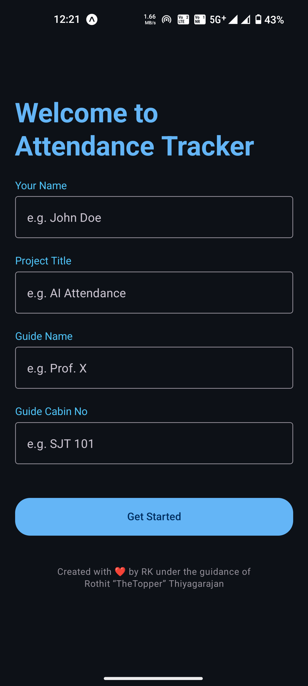
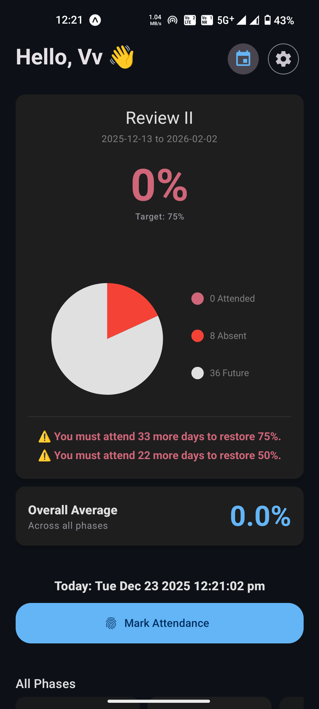
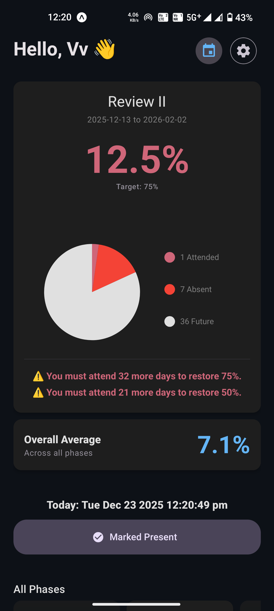
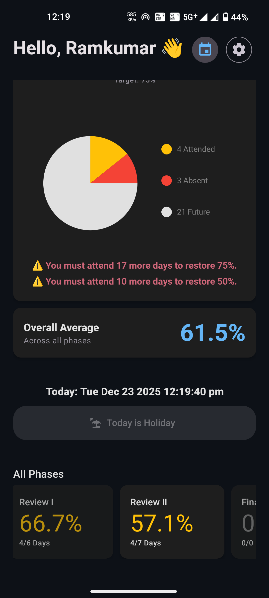
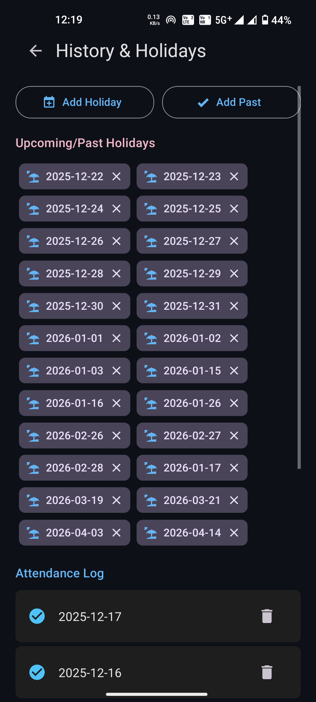

# Attendance Tracker App

## 🎓 Overview
This app is developed for **VIT Vellore SCOPE - B.Tech CSE & Specialization Program** as part of:
- **BCSE498J Project-II**
- **CBS1904 Capstone Project (In-House Project)**

### 🎯 Objective
To help students maintain the mandatory **75% attendance** requirement for:
- **Review II** (from Review I till Review II)
- **Final Review** (from Review II till Final Review)

A smart mobile application designed to help students manage their attendance effortlessly and ensure they meet these mandatory requirements.

## ✨ Features
- **Smart Dashboards:** Real-time visualization of attendance stats.
- **Attendance Goals:** Calculates exactly how many **days** you need to provide **biometric attendance** in the academic block to maintain **75%** and **50%** attendance.
- **Smart Reminders:** Sends notifications to remind you to record your attendance.
- **Skipping Calculator:** Intelligent recommendations on how many days you can safely skip while staying above the threshold.
- **Clean UI:** A polished, user-friendly interface designed for daily use.

## 📱 Download
You can download the latest version of the app from the Releases page:
[**Download APK**](https://github.com/ramkumar03ace/attendance-tracker-app/releases)

> **Note:** If you are installing the APK manually, make sure to enable "Install from Unknown Sources" in your device settings.

## 📸 Screenshots
<p align="center">
  
  
  
</p>
<br>
<p align="center">
  
  
  
</p>

## 🛠️ Built With
- **React Native** (Expo)
- **JavaScript**

## 🚀 Getting Started
1. Clone the repository:
   ```bash
   git clone https://github.com/ramkumar03ace/attendance-tracker-app.git
   ```
2. Install dependencies:
   ```bash
   npm install
   ```
3. Run the app:
   ```bash
   npx expo start
   ```

## 📄 License
This project is open source.
